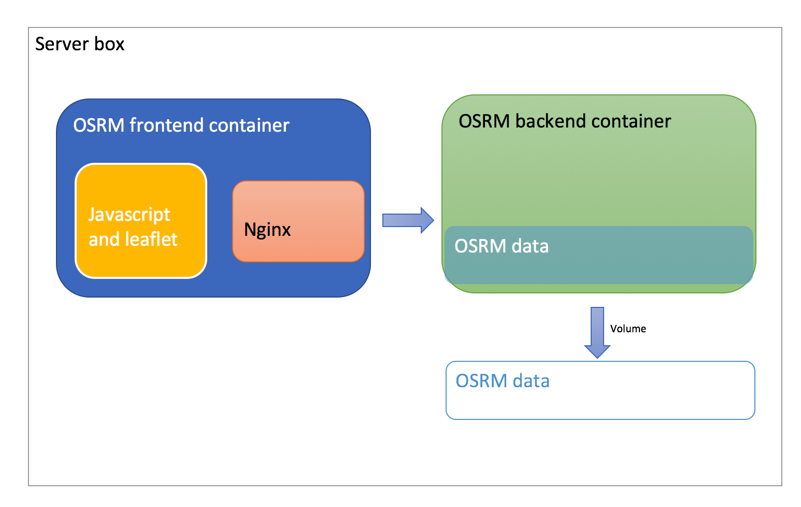

# Build OSRM frontend

OSRM frontend image has been built from github's code.




## Build image
Go to the folder where docker file located  
```bash
pwd
# local-path/osrm-backend/docker-orchestration/osrm-frontend-docker/
```
Run following command
```bash
docker build -t osrm-frontend-test -f Dockerfile .
```

## Start container

```bash
docker run -d --link osrm-api:api --name osrm-ca-front --restart=always -p 8080:80 osrm-front-test 
```

Notes:  
- docker run --link combines two docker container together.
  Latter we could try with [docker bridge network](https://docs.docker.com/network/bridge/)

<br/>
Visit OSRM front end with

```bash
http://ipaddress:8080
```

