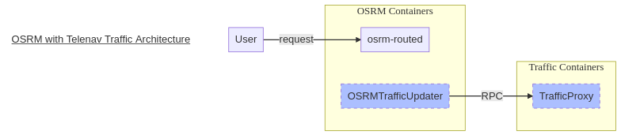
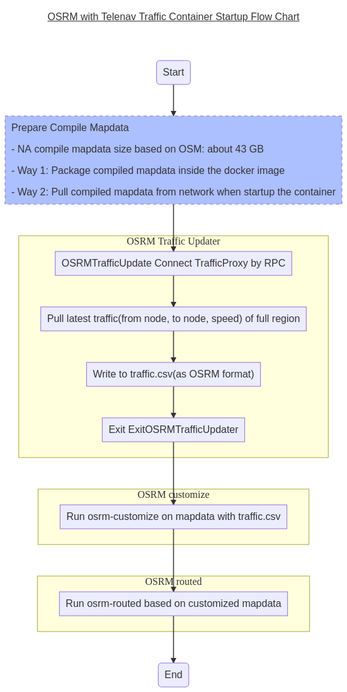
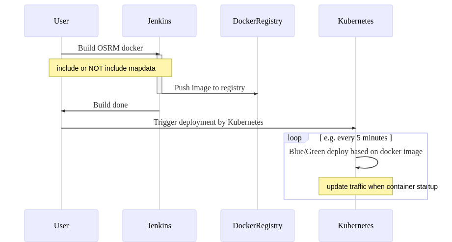

# OSRM with Telenav Traffic Design

## Architecture

### OSRMTrafficUpdater
- as `RPC` client
- connect `TrafficProxy` by `RPC`
- convert contents from `RPC` protocol to `OSRM` required `csv` format, then write to file

### TrafficProxy
- as `RPC` server
- provide traffic contents by region
- contents include at least `+/-wayid, speed`

## OSRM with Traffic Startup Flow

## Release and Deployment Pipeline
