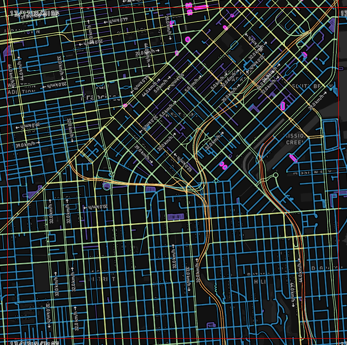

## General options

All OSRM HTTP requests use a common structure.

The following syntax applies to all services, except as noted.

### Requests

```endpoint
GET /{service}/{version}/{profile}/{coordinates}[.{format}]?option=value&option=value
```

| Parameter | Description |
| --- | --- |
| `service` | One of the following values: [`route`](#route-service), [`nearest`](#nearest-service), [`table`](#table-service), [`match`](#match-service), [`trip`](#trip-service), [`tile`](#tile-service) |
| `version` | Version of the protocol implemented by the service. `v1` for all OSRM 5.x installations |
| `profile` | Mode of transportation, is determined statically by the Lua profile that is used to prepare the data using `osrm-extract`. Typically `car`, `bike` or `foot` if using one of the supplied profiles. |
| `coordinates`| String of format `{longitude},{latitude};{longitude},{latitude}[;{longitude},{latitude} ...]` or `polyline({polyline})`. |
| `format`| Only `json` is supported at the moment. This parameter is optional and defaults to `json`. |

Passing any `option=value` is optional. `polyline` follows Google's polyline format with precision 5 by default and can be generated using [this package](https://www.npmjs.com/package/polyline).

To pass parameters to each location some options support an array like encoding:

**Request options**

| Option         | Values                                                 | Description                                                                                           |
|----------------|--------------------------------------------------------|-------------------------------------------------------------------------------------------------------|
|bearings        |`{bearing};{bearing}[;{bearing} ...]`                   |Limits the search to segments with given bearing in degrees towards true north in clockwise direction. |
|radiuses        |`{radius};{radius}[;{radius} ...]`                      |Limits the search to given radius in meters.                                                           |
|generate\_hints |`true` (default), `false`                               |Adds a Hint to the response which can be used in subsequent requests, see `hints` parameter.           |
|hints           |`{hint};{hint}[;{hint} ...]`                            |Hint from previous request to derive position in street network.                                       |

Where the elements follow the following format:

| Element    | Values                                                 |
|------------|--------------------------------------------------------|
|bearing     |`{value},{range}` `integer 0 .. 360,integer 0 .. 180`   |
|radius      |`double >= 0` or `unlimited` (default)                  |
|hint        |Base64 `string`                                         |

```
{option}={element};{element}[;{element} ... ]
```

The number of elements must match exactly the number of locations. If you don't want to pass a value but instead use the default you can pass an empty `element`.

Example: 2nd location use the default value for `option`:

```
{option}={element};;{element}
```

#### Example Requests

```curl
# Query on Berlin with three coordinates:
curl 'http://router.project-osrm.org/route/v1/driving/13.388860,52.517037;13.397634,52.529407;13.428555,52.523219?overview=false'

# Using polyline:
curl 'http://router.project-osrm.org/route/v1/driving/polyline(ofp_Ik_vpAilAyu@te@g`E)?overview=false'
```

### Responses

Every response object has a `code` property containing one of the strings below or a service dependent code:

| Type              | Description                                                                      |
|-------------------|----------------------------------------------------------------------------------|
| `Ok`              | Request could be processed as expected.                                          |
| `InvalidUrl`      | URL string is invalid.                                                           |
| `InvalidService`  | Service name is invalid.                                                         |
| `InvalidVersion`  | Version is not found.                                                            |
| `InvalidOptions`  | Options are invalid.                                                             |
| `InvalidQuery`    | The query string is synctactically malformed.                                    |
| `InvalidValue`    | The successfully parsed query parameters are invalid.                            |
| `NoSegment`       | One of the supplied input coordinates could not snap to street segment.          |
| `TooBig`          | The request size violates one of the service specific request size restrictions. |

- `message` is a **optional** human-readable error message. All other status types are service dependent.
- In case of an error the HTTP status code will be `400`. Otherwise the HTTP status code will be `200` and `code` will be `Ok`.

#### Example response

```json
{
"code": "Ok",
"message": "Everything worked"
}
```


## Services

### Nearest service

Snaps a coordinate to the street network and returns the nearest `n` matches.

```endpoint
GET http://{server}/nearest/v1/{profile}/{coordinates}.json?number={number}
```

Where `coordinates` only supports a single `{longitude},{latitude}` entry.

In addition to the [general options](#general-options) the following options are supported for this service:

|Option      |Values                        |Description                                         |
|------------|------------------------------|----------------------------------------------------|
|number      |`integer >= 1` (default `1`)  |Number of nearest segments that should be returned. |

**Response**

- `code` if the request was successful `Ok` otherwise see the service dependent and general status codes.
- `waypoints` array of `Waypoint` objects sorted by distance to the input coordinate. Each object has at least the following additional properties:
  - `distance`: Distance in meters to the supplied input coordinate.

#### Example Requests

```curl
# Querying nearest three snapped locations of `13.388860,52.517037` with a bearing between `20° - 340°`.
curl 'http://router.project-osrm.org/nearest/v1/driving/13.388860,52.517037?number=3&bearings=0,20'
```

#### Example Response

```json
{
   "waypoints" : [
      {
         "hint" : "KSoKADRYroqUBAEAEAAAABkAAAAGAAAAAAAAABhnCQCLtwAA_0vMAKlYIQM8TMwArVghAwEAAQH1a66g",
         "distance" : 4.152629,
         "name" : "Friedrichstraße",
         "location" : [
            13.388799,
            52.517033
         ]
      },
      {
         "hint" : "KSoKADRYroqUBAEABgAAAAAAAAAAAAAAKQAAABhnCQCLtwAA7kvMAAxZIQM8TMwArVghAwAAAQH1a66g",
         "distance" : 11.811961,
         "name" : "Friedrichstraße",
         "location" : [
            13.388782,
            52.517132
         ]
      },
      {
         "hint" : "KioKgDbbDgCUBAEAAAAAABoAAAAAAAAAPAAAABlnCQCLtwAA50vMADJZIQM8TMwArVghAwAAAQH1a66g",
         "distance" : 15.872438,
         "name" : "Friedrichstraße",
         "location" : [
            13.388775,
            52.51717
         ],
      }
   ],
   "code" : "Ok"
}
```

### Route service

Finds the fastest route between coordinates in the supplied order.

```endpoint
GET /route/v1/{profile}/{coordinates}?alternatives={true|false}&steps={true|false}&geometries={polyline|polyline6|geojson}&overview={full|simplified|false}&annotations={true|false}
```

In addition to the [general options](#general-options) the following options are supported for this service:

|Option      |Values                                       |Description                                                                    |
|------------|---------------------------------------------|-------------------------------------------------------------------------------|
|alternatives|`true`, `false` (default)                    |Search for alternative routes and return as well.\*                            |
|steps       |`true`, `false` (default)                    |Return route steps for each route leg                                          |
|annotations |`true`, `false` (default), `nodes`, `distance`, `duration`, `datasources`, `weight`, `speed`  |Returns additional metadata for each coordinate along the route geometry.      |
|geometries  |`polyline` (default), `polyline6`, `geojson` |Returned route geometry format (influences overview and per step)              |
|overview    |`simplified` (default), `full`, `false`      |Add overview geometry either full, simplified according to highest zoom level it could be display on, or not at all.|
|continue\_straight |`default` (default), `true`, `false` |Forces the route to keep going straight at waypoints constraining uturns there even if it would be faster. Default value depends on the profile. |

\* Please note that even if an alternative route is requested, a result cannot be guaranteed.

**Response**

- `code` if the request was successful `Ok` otherwise see the service dependent and general status codes.
- `waypoints`: Array of `Waypoint` objects representing all waypoints in order:
- `routes`: An array of `Route` objects, ordered by descending recommendation rank.

In case of error the following `code`s are supported in addition to the general ones:

| Type              | Description     |
|-------------------|-----------------|
| `NoRoute`         | No route found. |

All other properties might be undefined.

#### Example Request

```curl
# Query on Berlin with three coordinates and no overview geometry returned:
curl 'http://router.project-osrm.org/route/v1/driving/13.388860,52.517037;13.397634,52.529407;13.428555,52.523219?overview=false'
```

### Table service

Computes the duration of the fastest route between all pairs of supplied coordinates.

```endpoint
GET /table/v1/{profile}/{coordinates}?{sources}=[{elem}...];&destinations=[{elem}...]
```

**Coordinates**

In addition to the [general options](#general-options) the following options are supported for this service:

|Option      |Values                                            |Description                                  |
|------------|--------------------------------------------------|---------------------------------------------|
|sources     |`{index};{index}[;{index} ...]` or `all` (default)|Use location with given index as source.     |
|destinations|`{index};{index}[;{index} ...]` or `all` (default)|Use location with given index as destination.|

Unlike other array encoded options, the length of `sources` and `destinations` can be **smaller or equal**
to number of input locations;

**Example:**

```
sources=0;5;7&destinations=5;1;4;2;3;6
```

|Element     |Values                       |
|------------|-----------------------------|
|index       |`0 <= integer < #locations`  |

#### Example Request

```curl
# Returns a 3x3 matrix:
curl 'http://router.project-osrm.org/table/v1/driving/13.388860,52.517037;13.397634,52.529407;13.428555,52.523219'

# Returns a 1x3 matrix
curl 'http://router.project-osrm.org/table/v1/driving/13.388860,52.517037;13.397634,52.529407;13.428555,52.523219?sources=0'

# Returns a asymmetric 3x2 matrix with from the polyline encoded locations `qikdcB}~dpXkkHz`:
curl 'http://router.project-osrm.org/table/v1/driving/polyline(egs_Iq_aqAppHzbHulFzeMe`EuvKpnCglA)?sources=0;1;3&destinations=2;4'
```

**Response**

- `code` if the request was successful `Ok` otherwise see the service dependent and general status codes.
- `durations` array of arrays that stores the matrix in row-major order. `durations[i][j]` gives the travel time from
  the i-th waypoint to the j-th waypoint. Values are given in seconds. Can be `null` if no route between `i` and `j` can be found.
- `sources` array of `Waypoint` objects describing all sources in order
- `destinations` array of `Waypoint` objects describing all destinations in order

In case of error the following `code`s are supported in addition to the general ones:

| Type              | Description     |
|-------------------|-----------------|
| `NoTable`        | No route found. |

All other properties might be undefined.

### Match service

Map matching matches/snaps given GPS points to the road network in the most plausible way.
Please note the request might result multiple sub-traces. Large jumps in the timestamps (> 60s) or improbable transitions lead to trace splits if a complete matching could not be found.
The algorithm might not be able to match all points. Outliers are removed if they can not be matched successfully.

```endpoint
GET /match/v1/{profile}/{coordinates}?steps={true|false}&geometries={polyline|polyline6|geojson}&overview={simplified|full|false}&annotations={true|false}
```

In addition to the [general options](#general-options) the following options are supported for this service:

|Option      |Values                                          |Description                                                                               |
|------------|------------------------------------------------|------------------------------------------------------------------------------------------|
|steps       |`true`, `false` (default)                       |Return route steps for each route                                                         |
|geometries  |`polyline` (default), `polyline6`, `geojson`    |Returned route geometry format (influences overview and per step)                         |
|annotations |`true`, `false` (default), `nodes`, `distance`, `duration`, `datasources`, `weight`, `speed`  |Returns additional metadata for each coordinate along the route geometry.                 |
|overview    |`simplified` (default), `full`, `false`         |Add overview geometry either full, simplified according to highest zoom level it could be display on, or not at all.|
|timestamps  |`{timestamp};{timestamp}[;{timestamp} ...]`     |Timestamps for the input locations in seconds since UNIX epoch. Timestamps need to be monotonically increasing. |
|radiuses    |`{radius};{radius}[;{radius} ...]`              |Standard deviation of GPS precision used for map matching. If applicable use GPS accuracy.|
|gaps        |`split` (default), `ignore`                     |Allows the input track splitting based on huge timestamp gaps between points.             |
|tidy        |`true`, `false` (default)                       |Allows the input track modification to obtain better matching quality for noisy tracks.   |

|Parameter   |Values                             |
|------------|-----------------------------------|
|timestamp   |`integer` seconds since UNIX epoch |
|radius      |`double >= 0` (default 5m)         |

The radius for each point should be the standard error of the location measured in meters from the true location.
Use `Location.getAccuracy()` on Android or `CLLocation.horizontalAccuracy` on iOS.
This value is used to determine which points should be considered as candidates (larger radius means more candidates) and how likely each candidate is (larger radius means far-away candidates are penalized less).
The area to search is chosen such that the correct candidate should be considered 99.9% of the time (for more details see [this ticket](https://github.com/Project-OSRM/osrm-backend/pull/3184)).

**Response**

- `code` if the request was successful `Ok` otherwise see the service dependent and general status codes.
- `tracepoints`: Array of `Waypoint` objects representing all points of the trace in order.
  If the trace point was ommited by map matching because it is an outlier, the entry will be `null`.
  Each `Waypoint` object has the following additional properties:
  - `matchings_index`: Index to the `Route` object in `matchings` the sub-trace was matched to.
  - `waypoint_index`: Index of the waypoint inside the matched route.
  - `alternatives_count`: number of alternative routes leading to the destination from this trace point. 0 means there are no other routes reaching destination. Greater values mean that there are different routes available and different route can be selected if you provide more coordinates.
- `matchings`: An array of `Route` objects that assemble the trace. Each `Route` object has the following additional properties:
  - `confidence`: Confidence of the matching. `float` value between 0 and 1. 1 is very confident that the matching is correct.

In case of error the following `code`s are supported in addition to the general ones:

| Type              | Description         |
|-------------------|---------------------|
| `NoMatch`         | No matchings found. |

All other properties might be undefined.

### Trip service

The trip plugin solves the Traveling Salesman Problem using a greedy heuristic (farthest-insertion algorithm) for 10 or more waypoints and uses brute force for less than 10 waypoints.
The returned path does not have to be the fastest path. As TSP is NP-hard it only returns an approximation.
Note that all input coordinates have to be connected for the trip service to work.

```endpoint
GET /trip/v1/{profile}/{coordinates}?roundtrip={true|false}&source{any|first}&destination{any|last}&steps={true|false}&geometries={polyline|polyline6|geojson}&overview={simplified|full|false}&annotations={true|false}'
```

In addition to the [general options](#general-options) the following options are supported for this service:

|Option      |Values                                          |Description                                                                |
|------------|------------------------------------------------|---------------------------------------------------------------------------|
|roundtrip   |`true` (default), `false`                       |Return route is a roundtrip (route returns to first location)              |
|source      |`any` (default), `first`                        |Return route starts at `any` or `first` coordinate                         |
|destination |`any` (default), `last`                         |Return route ends at `any` or `last` coordinate                            |
|steps       |`true`, `false` (default)                       |Return route instructions for each trip                                    |
|annotations |`true`, `false` (default), `nodes`, `distance`, `duration`, `datasources`, `weight`, `speed` |Returns additional metadata for each coordinate along the route geometry.  |
|geometries  |`polyline` (default), `polyline6`, `geojson`    |Returned route geometry format (influences overview and per step)          |
|overview    |`simplified` (default), `full`, `false`         |Add overview geometry either full, simplified according to highest zoom level it could be display on, or not at all.|

**Fixing Start and End Points**

It is possible to explicitely set the start or end coordinate of the trip.
When source is set to `first`, the first coordinate is used as start coordinate of the trip in the output. When destination is set to `last`, the last coordinate will be used as destination of the trip in the returned output. If you specify `any`, any of the coordinates can be used as the first or last coordinate in the output.

However, if `source=any&destination=any` the returned round-trip will still start at the first input coordinate by default.

Currently, not all combinations of `roundtrip`, `source` and `destination` are supported.
Right now, the following combinations are possible:

| roundtrip | source | destination | supported |
| :-- | :-- | :-- | :-- |
| true | first | last | **yes** |
| true | first | any | **yes** |
| true | any | last | **yes** |
| true | any | any | **yes** |
| false | first | last | **yes** |
| false | first | any | no |
| false | any | last | no |
| false | any | any | no |

#### Example Requests

```curl
# Round trip in Berlin with three stops:
curl 'http://router.project-osrm.org/trip/v1/driving/13.388860,52.517037;13.397634,52.529407;13.428555,52.523219'
```

```curl
# Round trip in Berlin with four stops, starting at the first stop, ending at the last:
curl 'http://router.project-osrm.org/trip/v1/driving/13.388860,52.517037;13.397634,52.529407;13.428555,52.523219;13.418555,52.523215?source=first&destination=last'
```

#### Response

- `code`: if the request was successful `Ok` otherwise see the service dependent and general status codes.
- `waypoints`: Array of `Waypoint` objects representing all waypoints in input order. Each `Waypoint` object has the following additional properties:
  - `trips_index`: Index to `trips` of the sub-trip the point was matched to.
  - `waypoint_index`: Index of the point in the trip.
- `trips`: An array of `Route` objects that assemble the trace.

In case of error the following `code`s are supported in addition to the general ones:

| Type              | Description         |
|-------------------|---------------------|
| `NoTrips`         | No trips found because input coordinates are not connected.|
| `NotImplemented`  | This request is not supported |

All other properties might be undefined.

### Tile service

This service generates [Mapbox Vector Tiles](https://www.mapbox.com/developers/vector-tiles/) that can be viewed with a vector-tile capable slippy-map viewer.  The tiles contain road geometries and metadata that can be used to examine the routing graph.  The tiles are generated directly from the data in-memory, so are in sync with actual routing results, and let you examine which roads are actually routable, and what weights they have applied.

```endpoint
GET /tile/v1/{profile}/tile({x},{y},{zoom}).mvt
```

The `x`, `y`, and `zoom` values are the same as described at https://wiki.openstreetmap.org/wiki/Slippy_map_tilenames, and are supported by vector tile viewers like [Mapbox GL JS](https://www.mapbox.com/mapbox-gl-js/api/).

#### Example request

```curl
# This fetches a Z=13 tile for downtown San Francisco:
curl 'http://router.project-osrm.org/tile/v1/car/tile(1310,3166,13).mvt'
```

#### Example response

> 
> http://map.project-osrm.org/debug/#14.33/52.5212/13.3919

The response object is either a binary encoded blob with a `Content-Type` of `application/x-protobuf`, or a `404` error.  Note that OSRM is hard-coded to only return tiles from zoom level 12 and higher (to avoid accidentally returning extremely large vector tiles).

Vector tiles contain two layers:

`speeds` layer:

| Property     | Type      | Description                              |
| ------------ | --------- | ---------------------------------------- |
| `speed`      | `integer` | the speed on that road segment, in km/h  |
| `is_small`   | `boolean` | whether this segment belongs to a small (< 1000 node) [strongly connected component](https://en.wikipedia.org/wiki/Strongly_connected_component) |
| `datasource` | `string`  | the source for the speed value (normally `lua profile` unless you're using the [traffic update feature](https://github.com/Project-OSRM/osrm-backend/wiki/Traffic), in which case it contains the stem of the filename that supplied the speed value for this segment |
| `duration`   | `float`   | how long this segment takes to traverse, in seconds |
| `name`       | `string`  | the name of the road this segment belongs to |

`turns` layer:

| Property     | Type      | Description                              |
| ------------ | --------- | ---------------------------------------- |
| `bearing_in` | `integer` | the absolute bearing that approaches the intersection.  -180 to +180, 0 = North, 90 = East |
| `turn_angle` | `integer` | the angle of the turn, relative to the `bearing_in`.  -180 to +180, 0 = straight ahead, 90 = 90-degrees to the right |
| `cost`       | `float`   | the time we think it takes to make that turn, in seconds.  May be negative, depending on how the data model is constructed (some turns get a "bonus"). |


## Result objects

### Route object

Represents a route through (potentially multiple) waypoints.

**Properties**

- `distance`: The distance traveled by the route, in `float` meters.
- `duration`: The estimated travel time, in `float` number of seconds.
- `geometry`: The whole geometry of the route value depending on `overview` parameter, format depending on the `geometries` parameter. See `RouteStep`'s `geometry` property for a parameter documentation.
- `weight`: The calculated weight of the route.
- `weight_name`: The name of the weight profile used during extraction phase.

| overview   | Description                 |
|------------|-----------------------------|
| simplified | Geometry is simplified according to the highest zoom level it can still be displayed on full. |
| full       | Geometry is not simplified. |
| false      | Geometry is not added.      |

- `legs`: The legs between the given waypoints, an array of `RouteLeg` objects.

#### Example

Three input coordinates, `geometry=geojson`, `steps=false`:

```json
{
  "distance": 90.0,
  "duration": 300.0,
  "weight": 300.0,
  "weight_name": "duration",
  "geometry": {"type": "LineString", "coordinates": [[120.0, 10.0], [120.1, 10.0], [120.2, 10.0], [120.3, 10.0]]},
  "legs": [
    {
      "distance": 30.0,
      "duration": 100.0,
      "steps": []
    },
    {
      "distance": 60.0,
      "duration": 200.0,
      "steps": []
    }
  ]
}
```

### RouteLeg object

Represents a route between two waypoints.

**Properties**

- `distance`: The distance traveled by this route leg, in `float` meters.
- `duration`: The estimated travel time, in `float` number of seconds.
- `weight`: The calculated weight of the route leg.
- `summary`: Summary of the route taken as `string`. Depends on the `summary` parameter:

| summary      |                                                                       |
|--------------|-----------------------------------------------------------------------|
| true         | Names of the two major roads used. Can be empty if route is too short.|
| false        | empty `string`                                                        |

- `steps`: Depends on the `steps` parameter.

| steps        |                                                                       |
|--------------|-----------------------------------------------------------------------|
| true         | array of `RouteStep` objects describing the turn-by-turn instructions |
| false        | empty array                                                           |

- `annotation`: Additional details about each coordinate along the route geometry:

| annotations  |                                                                       |
|--------------|-----------------------------------------------------------------------|
| true         | An `Annotation` object containing node ids, durations distances and   |
| false        | weights `undefined`                                                   |

#### Example

With `steps=false` and `annotations=true`:

```json
{
  "distance": 30.0,
  "duration": 100.0,
  "weight": 100.0,
  "steps": [],
  "annotation": {
    "distance": [5,5,10,5,5],
    "duration": [15,15,40,15,15],
    "datasources": [1,0,0,0,1],
    "nodes": [49772551,49772552,49786799,49786800,49786801,49786802],
    "speed": [0.3, 0.3, 0.3, 0.3, 0.3]
  }
}
```

### Annotation object

Annotation of the whole route leg with fine-grained information about each segment or node id.

**Properties**

- `distance`: The distance, in metres, between each pair of coordinates
- `duration`: The duration between each pair of coordinates, in seconds
- `datasources`: The index of the datasource for the speed between each pair of coordinates. `0` is the default profile, other values are supplied via `--segment-speed-file` to `osrm-contract`
- `nodes`: The OSM node ID for each coordinate along the route, excluding the first/last user-supplied coordinates
- `weight`: The weights between each pair of coordinates
- `speed`: Convenience field, calculation of `distance / duration` rounded to one decimal place

#### Example

```json
{
  "distance": [5,5,10,5,5],
  "duration": [15,15,40,15,15],
  "datasources": [1,0,0,0,1],
  "nodes": [49772551,49772552,49786799,49786800,49786801,49786802],
  "weight": [15,15,40,15,15]
}
```


### RouteStep object

A step consists of a maneuver such as a turn or merge, followed
by a distance of travel along a single way to the subsequent
step.

**Properties**

- `distance`: The distance of travel from the maneuver to the subsequent step, in `float` meters.
- `duration`: The estimated travel time, in `float` number of seconds.
- `geometry`: The unsimplified geometry of the route segment, depending on the `geometries` parameter.
- `weight`: The calculated weight of the step.

| `geometry` |                                                                    |
|------------|--------------------------------------------------------------------|
| polyline   | [polyline](https://www.npmjs.com/package/polyline) with precision 5 in [latitude,longitude] encoding |
| polyline6  | [polyline](https://www.npmjs.com/package/polyline) with precision 6 in [latitude,longitude] encoding |
| geojson    | [GeoJSON `LineString`](http://geojson.org/geojson-spec.html#linestring) |

- `name`: The name of the way along which travel proceeds.
- `ref`: A reference number or code for the way. Optionally included, if ref data is available for the given way.
- `pronunciation`: The pronunciation hint of the way name. Will be `undefined` if there is no pronunciation hit.
- `destinations`: The destinations of the way. Will be `undefined` if there are no destinations.
- `mode`: A string signifying the mode of transportation.
- `maneuver`: A `StepManeuver` object representing the maneuver.
- `intersections`: A list of `Intersection` objects that are passed along the segment, the very first belonging to the StepManeuver
- `rotary_name`: The name for the rotary. Optionally included, if the step is a rotary and a rotary name is available.
- `rotary_pronunciation`: The pronunciation hint of the rotary name. Optionally included, if the step is a rotary and a rotary pronunciation is available.

#### Example

```json
{
   "geometry" : "{lu_IypwpAVrAvAdI",
   "mode" : "driving",
   "duration" : 15.6,
   "weight" : 15.6,
   "intersections" : [
      {  "bearings" : [ 10, 92, 184, 270 ],
         "lanes" : [
            { "indications" : [ "left", "straight" ],
               "valid" : "false" },
            { "valid" : "true",
               "indications" : [ "right" ] }
         ],
         "out" : 2,
         "in" : 3,
         "entry" : [ "true", "true", "true", "false" ],
         "location" : [ 13.39677, 52.54366 ]
      },
      {  "out" : 1,
         "lanes" : [
            { "indications" : [ "straight" ],
               "valid" : "true" },
            { "indications" : [ "right" ],
               "valid" : "false" }
         ],
         "bearings" : [ 60, 240, 330 ],
         "in" : 0,
         "entry" : [ "false", "true", "true" ],
         "location" : [ 13.394718, 52.543096 ]
      }
   ],
   "name" : "Lortzingstraße",
   "distance" : 152.3,
   "maneuver" : {
      "modifier" : "right",
      "type" : "turn"
   }
}
```

### StepManeuver object

**Properties**

- `location`: A `[longitude, latitude]` pair describing the location of the turn.
- `bearing_before`: The clockwise angle from true north to the
  direction of travel immediately before the maneuver.  Range 0-359.
- `bearing_after`: The clockwise angle from true north to the
  direction of travel immediately after the maneuver.  Range 0-359.
- `type` A string indicating the type of maneuver. **new identifiers might be introduced without API change**
   Types  unknown to the client should be handled like the `turn` type, the existence of correct `modifier` values is guranteed.

| `type`           | Description                                                  |
|------------------|--------------------------------------------------------------|
| `turn`           | a basic turn into direction of the `modifier`                |
| `new name`       | no turn is taken/possible, but the road name changes. The road can take a turn itself, following `modifier`.                  |
| `depart`         | indicates the departure of the leg                           |
| `arrive`         | indicates the destination of the leg                         |
| `merge`          | merge onto a street (e.g. getting on the highway from a ramp, the `modifier specifies the direction of the merge`) |
| `ramp`           | **Deprecated**. Replaced by `on_ramp` and `off_ramp`.        |
| `on ramp`        | take a ramp to enter a highway (direction given my `modifier`) |
| `off ramp`       | take a ramp to exit a highway (direction given my `modifier`)  |
| `fork`           | take the left/right side at a fork depending on `modifier`   |
| `end of road`    | road ends in a T intersection turn in direction of `modifier`|
| `use lane`       | going straight on a specific lane                            |
| `continue`       | Turn in direction of `modifier` to stay on the same road     |
| `roundabout`     | traverse roundabout, has additional property `exit` with NR if the roundabout is left. The modifier specifies the direction of entering the roundabout. |
| `rotary`         | a traffic circle. While very similar to a larger version of a roundabout, it does not necessarily follow roundabout rules for right of way. It can offer `rotary_name` and/or `rotary_pronunciation` parameters (located in the RouteStep object) in addition to the `exit` parameter (located on the StepManeuver object).  |
| `roundabout turn`| Describes a turn at a small roundabout that should be treated as normal turn. The `modifier` indicates the turn direciton. Example instruction: `At the roundabout turn left`. |
| `notification`   | not an actual turn but a change in the driving conditions. For example the travel mode.  If the road takes a turn itself, the `modifier` describes the direction |

  Please note that even though there are `new name` and `notification` instructions, the `mode` and `name` can change
  between all instructions. They only offer a fallback in case nothing else is to report.

- `modifier` An optional `string` indicating the direction change of the maneuver.

| `modifier`        | Description                               |
|-------------------|-------------------------------------------|
| `uturn`           | indicates  reversal of direction          |
| `sharp right`     | a sharp right turn                        |
| `right`           | a normal turn to the right                |
| `slight right`    | a slight turn to the right                |
| `straight`        | no relevant change in direction           |
| `slight left`     | a slight turn to the left                 |
| `left`            | a normal turn to the left                 |
| `sharp left`      | a sharp turn to the left                  |

  The list of turns without a modifier is limited to: `depart/arrive`. If the source/target location is close enough to the `depart/arrive` location, no modifier will be given.

  The meaning depends on the `type` property.

| `type`                 | Description                                                                                                               |
|------------------------|---------------------------------------------------------------------------------------------------------------------------|
| `turn`                 | `modifier` indicates the change in direction accomplished through the turn                                                |
| `depart`/`arrive`      | `modifier` indicates the position of departure point and arrival point in relation to the current direction of travel      |

- `exit` An optional `integer` indicating number of the exit to take. The property exists for the `roundabout` / `rotary` property:
  Number of the roundabout exit to take. If exit is `undefined` the destination is on the roundabout.


New properties (potentially depending on `type`) may be introduced in the future without an API version change.

### Lane object

A `Lane` represents a turn lane at the corresponding turn location.

**Properties**

- `indications`: a indication (e.g. marking on the road) specifying the turn lane. A road can have multiple indications (e.g. an arrow pointing straight and left). The indications are given in an array, each containing one of the following types. Further indications might be added on without an API version change.

| `value`                | Description                                                                                                               |
|------------------------|---------------------------------------------------------------------------------------------------------------------------|
| `none`                 | No dedicated indication is shown.                                                                                         |
| `uturn`                | An indication signaling the possibility to reverse (i.e. fully bend arrow).                                               |
| `sharp right`          | An indication indicating a sharp right turn (i.e. strongly bend arrow).                                                   |
| `right`                | An indication indicating a right turn (i.e. bend arrow).                                                                  |
| `slight right`         | An indication indicating a slight right turn (i.e. slightly bend arrow).                                                  |
| `straight`             | No dedicated indication is shown (i.e. straight arrow).                                                                   |
| `slight left`          | An indication indicating a slight left turn (i.e. slightly bend arrow).                                                   |
| `left`                 | An indication indicating a left turn (i.e. bend arrow).                                                                   |
| `sharp left`           | An indication indicating a sharp left turn (i.e. strongly bend arrow).                                                    |

- `valid`: a boolean flag indicating whether the lane is a valid choice in the current maneuver

#### Example

```json
{
    "indications": ["left", "straight"],
    "valid": "false"
}
 ```

### Intersection object

An intersection gives a full representation of any cross-way the path passes bay. For every step, the very first intersection (`intersections[0]`) corresponds to the
location of the StepManeuver. Further intersections are listed for every cross-way until the next turn instruction.

**Properties**

- `location`: A `[longitude, latitude]` pair describing the location of the turn.
- `bearings`: A list of bearing values (e.g. [0,90,180,270]) that are available at the intersection. The bearings describe all available roads at the intersection.  Values are between 0-359 (0=true north)
- `entry`: A list of entry flags, corresponding in a 1:1 relationship to the bearings. A value of `true` indicates that the respective road could be entered on a valid route.
  `false` indicates that the turn onto the respective road would violate a restriction.
- `in`: index into bearings/entry array. Used to calculate the bearing just before the turn. Namely, the clockwise angle from true north to the
  direction of travel immediately before the maneuver/passing the intersection. Bearings are given relative to the intersection. To get the bearing
  in the direction of driving, the bearing has to be rotated by a value of 180. The value is not supplied for `depart` maneuvers.
- `out`: index into the bearings/entry array. Used to extract the bearing just after the turn. Namely, The clockwise angle from true north to the
  direction of travel immediately after the maneuver/passing the intersection. The value is not supplied for `arrive` maneuvers.
- `lanes`: Array of `Lane` objects that denote the available turn lanes at the intersection. If no lane information is available for an intersection, the `lanes` property will not be present.

#### Example

```json
{
    "location":[13.394718,52.543096],
    "in":0,
    "out":2,
    "bearings":[60,150,240,330],
    "entry":["false","true","true","true"],
    "lanes":{
        "indications": ["left", "straight"],
        "valid": "false"
    }
}
```

### Waypoint object

Object used to describe waypoint on a route.

**Properties**

- `name` Name of the street the coordinate snapped to
- `location` Array that contains the `[longitude, latitude]` pair of the snapped coordinate
- `hint` Unique internal identifier of the segment (ephemeral, not constant over data updates)
   This can be used on subsequent request to significantly speed up the query and to connect multiple services.
   E.g. you can use the `hint` value obtained by the `nearest` query as `hint` values for `route` inputs.

#### Example

```json
{
   "hint" : "KSoKADRYroqUBAEAEAAAABkAAAAGAAAAAAAAABhnCQCLtwAA_0vMAKlYIQM8TMwArVghAwEAAQH1a66g",
   "distance" : 4.152629,
   "name" : "Friedrichstraße",
   "location" : [
      13.388799,
      52.517033
   ]
}
```
